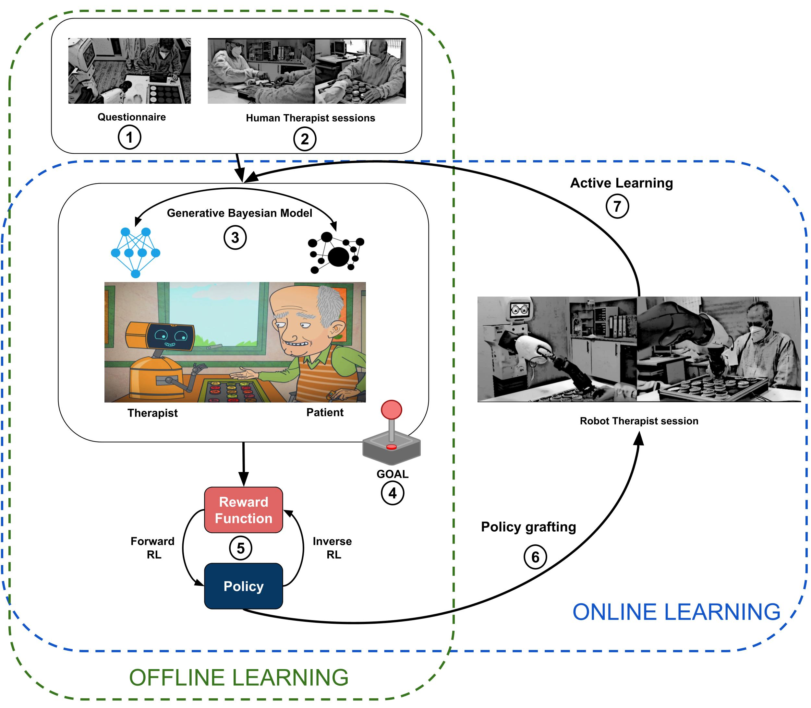

# CARESSER: Personalised Robot-assisted Cognitive Training

#### "Introducing CARESSER: a Framework for in Situ Learning Robot Social Assistance from Expert Knowledge and Demonstrations" [Website link](http://www.iri.upc.edu/groups/perception/#CARESSER)

##### Authors: Antonio Andriella, Carme Torras, Carla Abdelnour and Guillem Alenyà

<p align="center">
  
</p>

```diff
- N.B: main branch does not work, need to use either caregiver_in_the_loop or robot_in_the_loop
```

#### Packages:
- [CARESSER (aCtive leARning agEnt aSsiStive bEhaviouR)](https://github.com/aandriella/CARESSER)
The main package in change of generating the exercise and managing the interactions between the patients and the therapist (either human or robot). It has two branches (ignore the main):
-- caregiver_in_the_loop: the therapist is the human
-- robot_in_the_loop: the therapist is the robot
- [Bayesian Network Generative Model](https://github.com/aandriella/BN_GenerativeModel)
This package generates two bayesian models by combining the data collected from the interactions between the therapist and the patient and the therapist's expertise (from questionnaire). The models are actively refined during the interaction between the robot and the patient.
- [Robot Behaviour](https://github.com/aandriella/robot_behaviour)
This package defines the TIAGo assistive behaviours. We defined 7 different levels of assistance combining speech, gesture and facial expressions.
- [Board State](https://github.com/aandriella/board_state)
This package provides the positions of the tokens on the board (RFID + Arduino).
- [Robot Face Visalizer](https://github.com/aandriella/robot_face_visualizer)
This package reproduces on a screen some facial expressions.
- [Robot Face Expression](https://github.com/aandriella/robot_face_expression)
This pakage generates the facial expressions using OpenCV, it is based on previous work of [Bilgehan NAL](https://github.com/bilgehannal/baxter_face_software) on the Baxter robot.
- [MaxEntIRL](https://github.com/aandriella/MaxEntIRL)
This package generates the robot's policy by the data provided by the GOAL simulator. It is based on the work of [Maximilian Luz](https://github.com/qzed/irl-maxent).
- [GOAL sim](https://github.com/aandriella/GOAL)
This package generates the simulation as well as the policy to embed on the robot by starting from the BN models of the therapist and the robot. The BNs are built by gathering data from real interactions and therapist's expertise on the patient cognitive abilities.
- [Task Env](https://github.com/aandriella/task_environment)
This package contains the cognitive training domain both for the IRL algorithm and for the real time interaction between the patient and the therapist (human or robot).
